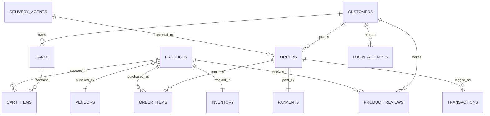

# Online Shopping System

This repository contains a database systems course project for a console-based online shopping platform built with `Python` and `SQLite`. It covers customer login, product browsing, cart persistence, checkout, order history, and customer-spending analysis while keeping the original academic project theme intact.

## What Changed

The repo has been cleaned up from a one-off script submission into a more maintainable project:

- separated schema creation, data seeding, analytics, and runtime app logic
- fixed checkout correctness with real `orders`, `order_items`, `payments`, and `transactions`
- removed the hardcoded local database path
- added SQLite constraints and triggers for inventory sync and login blocking
- kept `Zapnit.py` and `SQLzapnit.py` as compatibility entry points
- added tests for login blocking, checkout, stock updates, and analytics

## Tech Stack

- `Python`
- `SQLite`
- file-based local database for fast setup and inspection

## Repository Structure

- `app.py`: interactive console app for login, browsing, cart management, checkout, and history
- `store.py`: core business logic for authentication, cart persistence, and checkout
- `analytics.py`: customer and operational analysis queries
- `seed.py`: rebuilds the sample database with clean schema and demo data
- `db.py`: shared SQLite connection and schema helpers
- `schema.sql`: normalized SQLite schema, constraints, and triggers
- `tests/test_workflow.py`: regression coverage for the main workflows
- `Zapnit.py`: compatibility launcher for the shopping app
- `SQLzapnit.py`: compatibility launcher for database reset/setup
- `Online Shopping System.zip`: archived original submission bundle

## Running the Project

Make sure Python 3 is installed, then rebuild the sample database:

```powershell
python SQLzapnit.py
```

Run the shopping app:

```powershell
python Zapnit.py
```

Run the test suite:

```powershell
python -m unittest discover -s tests -v
```

## Sample Login Credentials

- `Raj Kumar` / `9123456780`
- `Sita Garg` / `9234567891`
- `Amit Patel` / `9345678902`

Three failed attempts against a known phone number will block that customer account through a database trigger.

## Schema Overview

The current schema models:

- customers and login attempts
- vendors and products
- carts and cart items
- orders and order items
- payments and transactions
- delivery agents, reviews, and inventory



## Functional Coverage

- customer login with blocked-account enforcement
- browsing all products or products by category
- persistent cart updates before checkout
- checkout with stock validation and payment logging
- delivery-agent assignment
- order-history inspection
- per-customer spending and favorite-product analysis
- low-stock and top-customer operational reporting

## Contributors

- Arnav Batra
- Dikshant
- Snigdha
